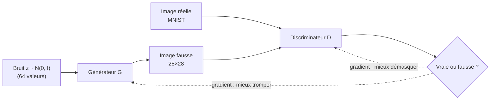

# TP7 — Générer des chiffres MNIST avec un GAN

Sujet : [brief.md](brief.md), précisé dans [brief-clarified.md](brief-clarified.md).

## Principe

Un GAN (*Generative Adversarial Network*) met en compétition deux réseaux :

- le **générateur G**, un faussaire : à partir d'un bruit aléatoire z, il fabrique une image ;
- le **discriminateur D**, un policier : il reçoit une image et dit si elle est vraie (MNIST) ou fausse (produite par G).

D apprend à démasquer les faux, G apprend à tromper D. À force de progresser l'un contre l'autre, G finit par produire des chiffres crédibles, sans jamais avoir vu directement une image MNIST : il n'apprend qu'à travers les réponses de D.



## Chaîne complète

```bash
mise run tp7-train   # train.py -> gan-mnist.pth, public/generator.onnx, samples/epoch-XX.png
mise run tp7         # application Web : http://localhost:5173
```

| Fichier | Rôle |
| --- | --- |
| `train.py` | GAN MLP (G : 64 → 256 → 512 → 784 + tanh ; D : 784 → 512 → 256 → 1), perte BCE, Adam. Une grille 8 × 8 par époque dans `samples/` (même bruit à chaque époque), export du générateur en ONNX (batch dynamique) avec vérification de parité. CUDA si disponible, sinon CPU. |
| `src/generator.ts` | Chargement de `generator.onnx` : `latent` [batch, 64] → `output` [batch, 1, 28, 28]. |
| `src/main.ts` | Tirage de 64 bruits z, génération et affichage de la grille, bouton « Générer ». |

## Lire les logs

- **D(x)** : probabilité moyenne donnée par D aux vraies images (idéal pour D : 1).
- **D(G(z))** : probabilité moyenne donnée par D aux fausses images (idéal pour D : 0, pour G : 1).
- Un entraînement sain garde les deux valeurs loin de 0 et de 1 : aucun des deux joueurs ne gagne définitivement. Si D(G(z)) tombe à 0 et y reste, D a gagné et G n'apprend plus.

## Expériences

```bash
mise run tp7-train --epochs 50   # chiffres plus nets ?
mise run tp7-train --latent 2    # bruit très petit : moins de variété ?
mise run tp7-train --lr 1e-3     # apprentissage plus instable ?
mise run tp7-train --seed 1      # un autre tirage : mêmes résultats ?
```

## Questions de discussion

- Comment évoluent les grilles de `samples/` d'une époque à l'autre ? À partir de quand reconnaît-on des chiffres ?
- Les dix chiffres apparaissent-ils tous dans la grille, ou certains manquent-ils (*mode collapse*) ?
- Pourquoi la perte de G ne diminue-t-elle pas régulièrement, contrairement à celle d'un classifieur ?
- Pourquoi n'exporte-t-on que le générateur pour l'application Web ?
