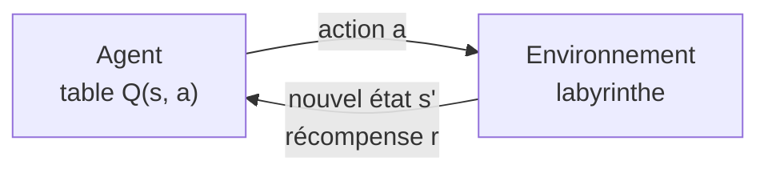

# TP8 — Apprentissage par renforcement : Q-learning dans un labyrinthe

Sujet : [brief.md](brief.md), précisé dans [brief-clarified.md](brief-clarified.md).

```bash
mise run tp8   # application Web : http://localhost:5173
```

Tout se passe dans le navigateur : pas de Python, pas de jeu de données, pas de modèle pré-entraîné. L'agent apprend sous vos yeux.

## Principe

En apprentissage supervisé (TP1 à TP7), on montre au modèle la bonne réponse. En apprentissage par renforcement, personne ne donne la réponse : un **agent** agit dans un **environnement**, reçoit des **récompenses**, et doit découvrir seul quelles actions rapportent le plus sur le long terme.



### Le labyrinthe comme MDP

Un problème de RL se formalise par un processus de décision markovien (MDP) :

| Élément | Dans ce TP |
| --- | --- |
| **États** s | les cases couloir de la grille |
| **Actions** a | haut, bas, gauche, droite |
| **Transition** | déterministe : on avance d'une case, ou on reste sur place si c'est un mur |
| **Récompense** r | +100 en atteignant la sortie G (fin de l'épisode), −1 par pas, −5 en heurtant un mur (à la place du −1) |
| **Épisode** | de S jusqu'à G, ou jusqu'à la limite de 4 × (nombre de cases couloir) pas |

### Retour et fonction Q

L'agent cherche à maximiser le **retour actualisé** :

$$G_t = r_{t+1} + \gamma\, r_{t+2} + \gamma^2 r_{t+3} + \dots$$

Le facteur $\gamma \in [0, 1]$ règle l'horizon : une récompense reçue dans $k$ pas vaut $\gamma^k$ fois moins qu'une récompense immédiate.

La **fonction Q** $Q(s, a)$ estime le retour obtenu en jouant $a$ dans l'état $s$, puis en jouant au mieux. La **valeur** d'un état est $V(s) = \max_a Q(s, a)$ et la **politique** gloutonne choisit $\arg\max_a Q(s, a)$.

La Q optimale vérifie l'**équation de Bellman** :

$$Q^*(s, a) = r + \gamma \max_{a'} Q^*(s', a')$$

### Mise à jour du Q-learning

L'agent ne connaît ni le plan ni les récompenses. Après chaque transition $(s, a, r, s')$, il rapproche $Q(s, a)$ de la **cible** de Bellman :

$$Q(s,a) \leftarrow Q(s,a) + \alpha \left[ \underbrace{r + \gamma \max_{a'} Q(s',a')}_{\text{cible}} - Q(s,a) \right]$$

- $\alpha$ : taux d'apprentissage, c'est-à-dire la part de l'écart corrigée à chaque fois.
- Si $s'$ est la sortie (état **terminal**), il n'y a pas de futur : la cible vaut simplement $r$.
- Si l'épisode est **tronqué** par la limite de pas, $s'$ n'est pas terminal : on garde $\gamma \max Q(s', \cdot)$. La limite est une commodité de simulation, pas une propriété du labyrinthe.

La récompense de la sortie se propage ainsi **en arrière**, une case par passage, depuis G vers S.

### Exploration ou exploitation : ε-greedy

Si l'agent choisissait toujours sa meilleure action connue, il pourrait s'enfermer dans un mauvais chemin. Avec la politique **ε-greedy** :

- avec probabilité ε, il joue une action au hasard (**exploration**) ;
- sinon, il joue $\arg\max_a Q(s, a)$ (**exploitation**).

ε part de 1 (tout au hasard) et diminue à la fin de chaque épisode : $\varepsilon \leftarrow \max(\varepsilon_{min},\ \varepsilon \times \text{décroissance})$.

## Ce qu'on voit à l'écran

| Affichage | Notion |
| --- | --- |
| Couleur des cases (violet → jaune) | $V(s) = \max_a Q(s, a)$ : jaune = proche de la sortie en valeur |
| Cases grises | jamais visitées : l'agent n'a aucune estimation pour elles |
| Flèches | politique gloutonne $\arg\max_a Q(s, a)$ ; pas de flèche tant que la case n'a rien appris |
| Survol d'une case | les 4 valeurs $Q(s, \cdot)$, la meilleure en gras |
| Encart « Dernière transition » | le calcul exact de la mise à jour, en mode pas à pas |
| Courbe « pas par épisode » (échelle log) | la convergence : elle descend vers la ligne pointillée du plus court chemin |
| Courbe « récompense totale » | même information vue par la récompense ; la ligne pointillée est la récompense optimale |
| Points rouges | épisodes tronqués (sortie non atteinte) |

## Mode d'emploi

| Commande | Effet |
| --- | --- |
| ▶ Lecture / ⏸ Pause | apprentissage continu, animé à la vitesse choisie |
| Pas à pas | une seule transition, avec le détail du calcul de Q |
| Turbo | apprentissage aussi rapide que possible (l'affichage suit de loin), plafonné à n²/10 épisodes par image pour garder la courbe lisible |
| Reset | remet Q à zéro et ε à sa valeur initiale, même labyrinthe |
| Nouveau labyrinthe / Taille | nouveau labyrinthe aléatoire (toujours résoluble), agent remis à zéro |
| Curseurs | appliqués immédiatement, sans reset ; survolez-les pour une explication |
| Valeurs par défaut | α = 0,1, γ = 0,99, ε = 1 → 0,05 (× 0,99 par épisode), récompenses +100 / −1 / −5 |

| Fichier | Rôle |
| --- | --- |
| `src/maze.ts` | environnement : génération (recursive backtracker), dynamique `step`, plus court chemin (BFS) |
| `src/agent.ts` | agent : table Q, ε-greedy, mise à jour du Q-learning |
| `src/training.ts` | boucle d'interaction, fin d'épisode (terminal ou tronqué), historique |
| `src/renderer.ts`, `src/chart.ts` | dessin du labyrinthe et des courbes |
| `src/main.ts` | interface et boucle d'animation |

## Expériences

1. **Regarder la valeur se propager.** Lancez la lecture à vitesse lente sur un 5 × 5. Au premier épisode, seule la case voisine de G devient jaune. À chaque passage, la valeur recule d'une case vers S.
2. **Suivre une mise à jour.** En pas à pas, vérifiez à la main le calcul affiché. Pourquoi les valeurs Q deviennent-elles négatives partout avant que la sortie ne soit trouvée ?
3. **γ faible contre γ élevé.** Comparez γ = 0,5 et γ = 0,99 sur un 15 × 15 (Reset entre les deux). Avec γ = 0,5, que devient la couleur loin de G ? L'agent trouve-t-il encore la sortie ?
4. **Pas d'exploration.** Mettez ε initial = 0 et ε minimum = 0, puis Reset. L'agent apprend-il quand même ? Pourquoi l'initialisation Q = 0 combinée à des récompenses négatives pousse-t-elle déjà à explorer ?
5. **Toujours explorer.** Mettez la décroissance à 0,999 et ε minimum à 0,5. La politique (flèches) converge-t-elle, même si la courbe reste haute ?
6. **Récompenses.** Mettez la pénalité de pas à 0. L'agent a-t-il encore intérêt à se presser ? (Pensez au rôle de γ.) Et une pénalité de mur à 0 ?
7. **α = 1.** L'environnement est déterministe : que change un apprentissage « tout ou rien » ?
8. **Passer à l'échelle.** Un 25 × 25 en turbo : combien d'épisodes faut-il ? Combien de cases la table Q contient-elle ? Que se passerait-il avec un état décrit par une image, où les cases ne se comptent plus ? (C'est la motivation du Deep Q-Network.)

## Questions de discussion

- Pourquoi dit-on que le Q-learning est *off-policy* ? Quelle politique sert à agir, laquelle est apprise ?
- Pourquoi les flèches peuvent-elles indiquer le bon chemin alors que la courbe des pas reste au-dessus de l'optimum ?
- En quoi la distinction terminal / tronqué change-t-elle la cible ? Que se passerait-il si l'on traitait la troncature comme une fin normale ?
