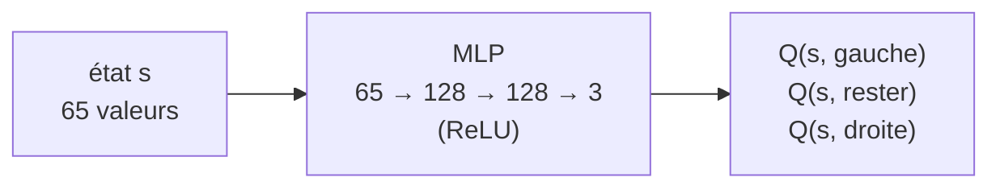

# TP9 — Apprentissage par renforcement profond : un agent DQN qui joue à Breakout

Sujet : [brief.md](brief.md), précisé dans [brief-clarified.md](brief-clarified.md).

```bash
mise run tp9   # application Web : http://localhost:5173
```

Comme au TP8, tout se passe dans le navigateur, sans Python ni ONNX. Le réseau de neurones est entraîné avec **TensorFlow.js** (backend WebGL, ou CPU si WebGL n'est pas disponible).

## Du TP8 au TP9 : pourquoi une table Q ne suffit plus

Au TP8, l'état était une case du labyrinthe : quelques centaines d'états, une ligne de table Q par état. Dans Breakout, l'état comprend la position et la vitesse de la balle (continues), la position de la raquette et l'état des 60 briques ($2^{60}$ combinaisons). Une table serait astronomique, et surtout elle ne **généraliserait** pas : chaque état serait vu au plus une fois.

On remplace donc la table par une **fonction paramétrée** $Q_\theta(s, a)$ : un réseau de neurones qui reçoit l'état et sort une valeur Q par action. Deux états proches (balle au même endroit, une brique de plus ou de moins) auront des Q proches, sans avoir été visités tous les deux.



## L'environnement

| Élément | Dans ce TP |
| --- | --- |
| **Observation** s | 65 valeurs : balle (x, y) dans [0, 1], vitesse (vx, vy) dans [−1, 1], raquette x dans [0, 1], 60 briques (1 = présente). Pas de pixels, pas de CNN. |
| **Actions** a | gauche, rester, droite |
| **Récompense** r | +1 par brique cassée, −1 par vie perdue, 0 sinon |
| **Épisode** | 3 vies ; fin quand il n'y a plus de vie ou plus de brique (terminal), ou après 10 000 pas de physique (troncature) |

Choix de conception :

- **Observation vectorielle** : l'information utile (où va la balle, où est la raquette) est donnée directement. Le réseau n'a pas à apprendre à voir, seulement à décider. Un MLP suffit, et l'apprentissage tient en quelques minutes dans un navigateur.
- **Physique à pas fixe** : la balle avance en 3 sous-pas par pas, et sa vitesse est plafonnée pour ne jamais traverser une brique ou la raquette. Le seul hasard est l'angle de lancement après chaque vie perdue.
- **Angle de renvoi** : il dépend du point d'impact sur la raquette (vertical au centre, jusqu'à 60° sur les bords). La balle accélère après 4 puis 12 renvois et au premier contact avec les deux rangées du haut. Ces accélérations repartent de zéro à chaque nouvelle balle.
- **Répétition d'action** (frame skip) : l'agent décide **tous les 4 pas de physique** et répète son action entre deux décisions, comme le DQN d'origine sur Atari. Deux décisions successives diffèrent ainsi vraiment, et une vie perdue se trouve à quelques dizaines de décisions de sa cause, au lieu de plus d'une centaine de pas : le crédit remonte plus vite. Le joueur humain, lui, commande la raquette à chaque pas.

## Le DQN

### Cible et perte

Comme au TP8, on rapproche $Q(s, a)$ de la cible de Bellman. Mais on ne peut plus écrire directement dans une case : on fait une **descente de gradient** sur les poids $\theta$ pour réduire l'écart entre $Q_\theta(s, a)$ et la cible

$$y = r + \gamma \max_{a'} Q_{\bar\theta}(s', a') \qquad (y = r \text{ si } s' \text{ est terminal})$$

L'écart est mesuré par la **perte de Huber** : quadratique pour les petits écarts, linéaire au-delà de 1. Une cible aberrante ne produit donc pas de gradient explosif. L'optimiseur est **Adam**.

### Deux astuces qui rendent l'apprentissage stable

Faire du gradient sur des transitions jouées à la suite, vers une cible calculée avec le réseau qu'on modifie, diverge facilement. Le DQN ajoute deux mécanismes :

1. **Replay buffer** (50 000 transitions). Chaque transition $(s, a, r, s', \text{done})$ est rangée dans un tampon circulaire. On apprend sur des **mini-batchs de 64 transitions tirées au hasard** : des transitions consécutives se ressemblent énormément (la balle a bougé de quelques pixels), et un tirage aléatoire **décorrèle** les exemples, comme en apprentissage supervisé. Chaque transition sert en plus plusieurs fois. L'apprentissage ne démarre qu'après 1 000 transitions (warm-up).
2. **Réseau cible** $Q_{\bar\theta}$. C'est une copie du réseau Q, **gelée** et recopiée seulement tous les C pas. Sans elle, chaque mise à jour déplace aussi la cible : on court après sa propre queue. Avec elle, la cible reste fixe pendant C pas.

### Exploration ε-greedy à décroissance linéaire

ε part de 1 (tout au hasard) et descend **linéairement** jusqu'à 0,05 en 50 000 décisions. Il ne décroît pas par épisode comme au TP8, parce que les épisodes n'ont pas du tout la même longueur au début et à la fin de l'entraînement.

### Vie perdue = état terminal

Pour la cible, une vie perdue est traitée comme un état terminal : on coupe le terme $\gamma \max Q(s', \cdot)$. C'est l'astuce classique du DQN sur Atari. L'agent n'a pas à comprendre que la partie continue après une balle perdue : perdre la balle, c'est simplement la fin du futur. La **troncature**, elle, n'est pas terminale (même distinction qu'au TP8) : on garde $\gamma \max Q(s', \cdot)$.

### Boucle complète

À chaque décision :

1. observer $s$, choisir $a$ en ε-greedy, le jouer 4 pas de physique, observer $r$ (somme des récompenses) et $s'$ ;
2. ranger $(s, a, r, s', \text{done})$ dans le replay buffer ;
3. toutes les 4 décisions (une fois le warm-up passé), tirer un mini-batch et faire une descente de gradient sur la perte de Huber ;
4. tous les C pas, recopier le réseau Q dans le réseau cible.

Faire une mise à jour toutes les 4 décisions plutôt qu'à chaque décision est aussi un choix du DQN d'origine : c'est 4 fois moins de calcul, et chaque transition est quand même tirée environ 16 fois pendant son séjour dans le buffer ($50\,000 / 4$ mises à jour $\times$ 64 tirages, répartis sur 50 000 transitions).

| Paramètre | Défaut | Réglable |
| --- | --- | --- |
| Taux d'apprentissage (Adam) | 1e-3 | oui |
| $\gamma$ | 0,99 | oui |
| ε initial → final | 1 → 0,05 | oui |
| Durée de décroissance de ε | 50 000 décisions | oui |
| Période de recopie du réseau cible C | 1 000 décisions | oui |
| Replay buffer, mini-batch, warm-up | 50 000, 64, 1 000 | non |
| Répétition d'action, fréquence d'apprentissage | 4 pas, 1 mise à jour / 4 décisions | non |

## Ce qu'on voit à l'écran

| Affichage | Notion |
| --- | --- |
| Courbe « briques cassées par épisode » | la performance de l'agent ; la ligne pleine est la moyenne glissante sur 20 épisodes |
| Ligne pointillée | score moyen d'une **politique aléatoire**, mesuré au démarrage sur 30 parties : au-dessus, l'agent fait mieux que le hasard |
| Points rouges | épisodes tronqués (10 000 pas atteints : l'agent ne perd plus, mais la balle tourne en boucle) |
| Courbe « perte de Huber » (échelle log) | l'écart entre Q et la cible. Elle **ne descend pas forcément** : quand l'agent s'améliore, les Q grandissent et les cibles bougent. C'est une différence majeure avec l'apprentissage supervisé. |
| Barres des Q-valeurs | $Q(s, \cdot)$ dans l'état affiché ; en or, l'action choisie. En greedy, c'est toujours la plus haute barre. En ε-greedy, l'étiquette précise si l'action vient du hasard. |
| ε courant, pas total, replay buffer | l'avancement de l'exploration et le remplissage du buffer |
| Tenseurs | nombre de tenseurs TensorFlow.js en mémoire : il doit rester stable (pas de fuite) |

## Mode d'emploi

| Commande | Effet |
| --- | --- |
| Entraînement | l'agent joue en ε-greedy et apprend |
| Démo | l'agent joue en greedy (ε = 0), sans apprendre ni remplir le buffer |
| Humain | vous jouez avec les flèches ← → ou la souris ; votre partie ne nourrit pas le buffer, et les barres montrent ce que l'agent ferait à votre place |
| ▶ Lecture / ⏸ Pause | démarre ou suspend la partie en cours |
| Vitesse | pas de physique par image affichée (entraînement et démo) |
| Turbo | entraînement aussi rapide que possible, l'affichage suit par tranches de 25 ms |
| Reset | nouveaux poids aléatoires, buffer vidé, ε et courbes remis à zéro |
| Curseurs, Valeurs par défaut | appliqués immédiatement, sans reset ; survolez-les pour une explication |
| Sauver / Charger (navigateur) | réseau Q dans le `localStorage` |
| Exporter / Importer… | fichiers `model.json` + `model.weights.bin` (format TensorFlow.js) ; à l'import, sélectionnez les deux fichiers ensemble |
| Modèle pré-entraîné | charge `public/model/model.json` |

Après un chargement, les poids vont dans le réseau Q et dans le réseau cible, le buffer est vidé, ε passe directement à sa valeur finale et la démo démarre. On peut ensuite reprendre l'entraînement.

### Régénérer le modèle pré-entraîné

1. `mise run tp9`, mode Entraînement, **Reset**, puis **Turbo** avec les valeurs par défaut.
2. Attendre que la moyenne glissante plafonne (quelques dizaines de milliers de décisions), puis **Pause**.
3. Vérifier en **Démo** que l'agent joue bien, puis **Exporter**.
4. Copier `model.json` et `model.weights.bin` dans `tp9/public/model/` (en remplaçant les anciens).

| Fichier | Rôle |
| --- | --- |
| `src/breakout.ts` | environnement : physique, règles, observation, récompenses (aucun lien avec le rendu) |
| `src/replay.ts` | replay buffer circulaire et tirage des mini-batchs |
| `src/dqn.ts` | réseau Q, réseau cible, ε-greedy, pas d'apprentissage (Huber + Adam), sauvegarde et chargement |
| `src/training.ts` | boucle d'interaction, répétition d'action, épisodes, baseline aléatoire |
| `src/renderer.ts`, `src/chart.ts` | dessin du jeu, des courbes et des barres de Q-valeurs |
| `src/main.ts` | interface, modes, clavier et souris, boucle d'animation |

## Expériences

1. **Battre le hasard.** Reset puis Turbo avec les valeurs par défaut. Au bout de combien de décisions la moyenne glissante dépasse-t-elle nettement la ligne pointillée ? Que vaut ε à ce moment-là ?
2. **Lire les Q-valeurs.** En Démo, suivez les barres quand la balle descend loin de la raquette. L'écart entre les trois actions grandit-il ? Et quand la balle monte vers les briques ?
3. **Vous contre l'agent.** Jouez une partie en mode humain. Regardez les barres : l'agent est-il d'accord avec vos choix ?
4. **γ faible.** Mettez γ = 0,5, puis Reset. Une récompense 10 décisions plus loin ne pèse plus que $0{,}5^{10} \approx 0{,}001$. L'agent anticipe-t-il encore la trajectoire de la balle ?
5. **Pas de réseau cible.** Mettez C = 1, puis Reset. La perte et le score deviennent-ils plus instables ?
6. **ε constant.** Mettez ε initial = ε final = 0,3. Le score en entraînement plafonne-t-il plus bas ? Et en Démo ?
7. **Taux d'apprentissage trop élevé.** Mettez 1e-2. Que deviennent la perte et les Q-valeurs ? Puis essayez 1e-5.
8. **Exploration trop courte.** Mettez la durée de décroissance de ε à 1 000. L'agent se fige-t-il sur une mauvaise stratégie ?

## Questions de discussion

- Pourquoi le replay buffer rend-il le DQN *off-policy* par nécessité ? Les transitions tirées ont été jouées par quelle politique ?
- Pourquoi la perte ne mesure-t-elle pas directement la qualité de l'agent, contrairement à l'apprentissage supervisé ?
- Traiter une vie perdue comme terminale change le problème résolu. En quoi ? Pourquoi est-ce acceptable ici ?
- Avec une observation en pixels, qu'est-ce qui changerait dans le réseau, dans l'observation (une seule image suffit-elle à connaître la vitesse ?) et dans le temps d'entraînement ?
